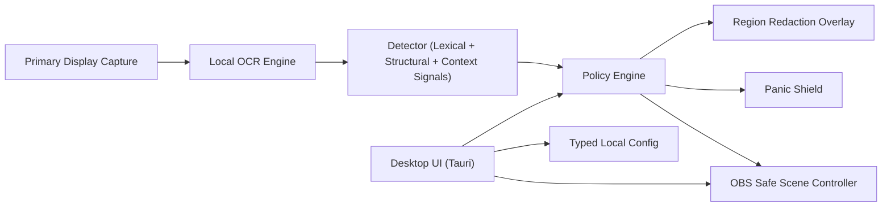

# StreamShield

StreamShield is a local-first desktop leak prevention utility that detects and redacts wallet-secret material during livestreams, recordings, demos, and screen sharing before it spreads to viewers.

License: **MIT** (see [LICENSE](./LICENSE)).

## Why StreamShield Exists

Wallet secrets can be exposed on-screen for only a few seconds and still cause catastrophic loss. StreamShield is designed to reduce accidental exposure risk for:

- Mnemonic seed/recovery phrases
- Grouped backup words (12/18/24)
- Private key and extended private key strings (`xprv`-like)
- Wallet backup/restore screens and warning copy

## Product Honesty

StreamShield reduces accidental leak risk. It does **not** guarantee perfect protection.

Residual risk still exists from:

- OCR latency
- capture latency
- overlay latency
- OBS scene-switch latency
- human mistakes and workflow errors

Use stream delay + a safe OBS scene + strong operational security.

## Privacy Guarantees

- Local-first architecture
- No telemetry
- No analytics
- No cloud OCR
- No screenshot upload
- No remote backend
- No user accounts
- No raw secret logging by default
- No secret retention by default

## Threat Model (MVP)

StreamShield is focused on accidental exposure during active presentation workflows:

- crypto livestreaming
- screen sharing support calls
- wallet walkthrough videos
- internal product demos

This is **not** surveillance software and not a cloud monitoring tool.

## Architecture Overview



## Workspace Layout

```text
StreamShield/
  Cargo.toml
  LICENSE
  README.md
  crates/
    core-types/     # core traits, findings, actions, config
    core-capture/   # Windows-first frame source skeleton
    core-ocr/       # local OCR backend abstraction + grouping
    core-detect/    # confidence-based detection heuristics
    core-policy/    # escalation policy engine
    core-redact/    # overlay target mapping + renderer skeleton
    core-obs/       # OBS controller + mockable transport
    core-runtime/   # scan orchestration pipeline (capture->ocr->detect->policy->actions)
  apps/
    desktop/
      src-tauri/    # Tauri shell + local config commands
      ui/           # calm local UI shell
```

## Core Abstractions

Implemented shared abstractions include:

- `FrameSource`
- `CapturedFrame`
- `OcrEngine`
- `OcrTextBlock`
- `Detector`
- `DetectionFinding`
- `FindingType`
- `ConfidenceLevel`
- `PolicyEngine`
- `ResponseAction`
- `RedactionTarget`
- `RedactionStyle`
- `RedactionRenderer`
- `PanicController`
- `ObsController`
- `AppConfig`

## Detection Strategy (MVP)

The detector combines multiple signals instead of keyword-only matching.

1. Mnemonic phrase signals
- 12/18/24-word candidate patterns
- overlap with synthetic BIP39-style wordlist entries
- grouped word layout signal
- numbered list signal
- contextual wallet warning signal

2. Private key signals
- `xprv`-like prefix + length pattern
- long secret-like encoded strings
- context-sensitive boosts

3. Context signals
- phrases like `seed phrase`, `recovery phrase`, `write this down`, `restore wallet`, `private key`

## Runtime Orchestration

`core-runtime` executes one scan cycle end-to-end:

- capture primary display frame
- run offline OCR
- detect findings with confidence
- evaluate policy decisions
- apply redaction / panic shield / OBS actions

It also supports panic-latch clearing for manual recovery flows.

## Policy and Escalation

Modes:

- `Balanced`: stronger evidence required
- `Strict`: lower thresholds for faster reaction
- `Paranoid`: aggressive thresholds

Default response pattern:

- Low: no-op or warning
- Medium: warning
- High: region redaction + optional OBS switch
- Critical: panic shield + OBS switch

## OBS Integration (MVP Skeleton)

- Uses `ObsController` abstraction in `core-obs`
- Configured with host, port, password, safe scene
- Includes connection test command in desktop shell
- Includes mock-based tests for connection/retry/failure flows

## Desktop UI (Tauri Shell)

Calm, security-focused shell panels:

1. Protection Dashboard
- protection state
- mode
- scan interval
- OCR backend status
- OBS status
- recent event summary (without secrets)

2. Detection Settings
- mode
- scan interval
- redaction style

3. Panic Controls
- panic behavior
- trigger/clear panic controls

4. OBS Settings
- host
- port
- safe scene
- connection test

5. Privacy and Limitations
- local-only guarantees
- explicit no-perfect-protection warning

## Configuration

Config is local-only and typed (`AppConfig`). Desktop shell stores config under the local OS config directory:

- Windows expected path pattern: `%APPDATA%/StreamShield/config.json`

No cloud sync and no remote account model.

## Logging and Diagnostics

By default:

- no raw OCR text logging
- no raw seed/private key logging
- no screenshot persistence

Only high-level event logging should be used (for example: `region redacted`, `panic triggered`, `OBS safe scene switched`).

## Install and Development

Prerequisites:

- Rust stable toolchain
- Cargo
- Tauri prerequisites for Windows (WebView2 runtime/dev dependencies)

Local development:

```bash
cargo test
cargo test -p core-detect
```

Desktop shell (Tauri):

```bash
cd apps/desktop/src-tauri
cargo tauri dev
```

## OCR Backend Notes (Offline)

`core-ocr` now integrates with local Tesseract via `leptess` and parses TSV output into structured `OcrTextBlock` bounding boxes.

Windows setup notes:

- Install Tesseract OCR locally (offline).
- Ensure `tesseract.exe` and required runtime libraries are available on PATH (or in a known location).
- Ensure `tessdata` language files exist (at least `eng`).
- StreamShield does not upload OCR data; frames are processed on-device.

Implementation note:

- On Windows, in-memory OCR input uses TIFF encoding to stay local and avoid screenshot file persistence by default.
## Testing Strategy

Current tests include:

1. Unit tests
- mnemonic candidate heuristics
- private-key-like pattern detection
- confidence scoring and policy escalation
- redaction target mapping

2. Fixture/regression tests
- OCR grouping behavior
- synthetic grouped 12/24-word phrases
- contextual wallet warning text
- false-positive checks for normal technical content

3. OBS tests
- mock connection success
- scene switch invocation
- retry behavior
- auth failure handling

All examples and fixtures are synthetic and invalid; no real wallet secrets are included.

## Operational Safety Guidance

- Never reveal real seeds on internet-connected streaming machines when avoidable.
- Prefer dummy wallets for public demos.
- Use stream delay.
- Configure and test a safe OBS scene.
- Separate streaming and wallet machines when practical.
- Treat StreamShield as a safety net, not a license for careless secret handling.

## Known Limitations (Blunt)

- MVP scans only the primary display.
- OCR quality depends on font size, contrast, motion blur, and capture timing.
- Some leaks may occur between scan cycles and reaction actions.
- No QR decoding in MVP.
- No wallet-specific CV model in MVP.
- No multi-monitor support in MVP.
- Desktop shell currently provides MVP command surface and UI skeleton, not a full production UX flow.

## Roadmap

- Multi-monitor capture support
- Pluggable OCR backends with stronger offline accuracy
- Better coordinate calibration and DPI handling
- Panic hotkey registration and global shortcut capture
- Optional advanced detection models (still local-only)
- Expanded OBS state synchronization and fail-safe behavior
- Signed release builds and installer pipeline

## Contributing

Contributions are welcome. Please prioritize:

- honest security claims
- privacy-first defaults
- safe logging and synthetic fixtures only
- modular, testable architecture


