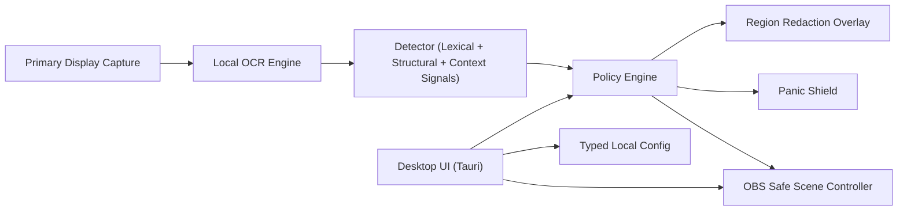

# StreamShield

StreamShield is a local-first desktop safety layer that helps reduce accidental wallet-secret leaks during livestreams, recordings, demos, and screen sharing.

It scans the screen locally, runs offline OCR, scores risk with wallet-aware heuristics, and can react with redaction, panic shielding, and OBS safe-scene switching.

License: **MIT** (see [LICENSE](./LICENSE)).

## Project Status

- Maturity: MVP (actively evolving)
- Platform focus: Windows-first desktop workflows
- Privacy model: local-only processing, no cloud backend
- Product promise: risk reduction, not perfect prevention

## Why StreamShield Exists

Wallet secrets can appear on screen for only a few seconds and still cause catastrophic loss. StreamShield is designed as an emergency safety net for:

- crypto livestreams
- wallet walkthrough videos
- support calls with screen sharing
- internal demos where sensitive recovery material may appear

Typical high-risk content includes:

- mnemonic recovery phrases (12/18/24 words)
- grouped recovery word layouts
- private key and extended private key patterns (`xprv`-like)
- wallet backup/restore warning screens

## Product Honesty

StreamShield reduces accidental leak risk. It does **not** guarantee perfect protection.

Residual risk can still come from:

- OCR latency
- capture latency
- render/overlay latency
- OBS switching latency
- workflow/operator mistakes

Treat StreamShield as defense-in-depth, not as permission to expose real secrets.

## Core Privacy Guarantees

- Local-first architecture
- No telemetry
- No analytics
- No cloud OCR
- No screenshot upload
- No remote backend
- No user accounts
- No raw secret logging by default
- No secret retention by default

## Threat Model (MVP)

StreamShield targets accidental on-screen disclosure during active presentation workflows.

In scope:

- accidental visibility of recovery material during streaming/demo activity
- reaction speed for likely high-risk wallet text patterns
- local automated fallback actions (redact/panic/OBS)

Out of scope:

- malware on the host machine
- deliberate exfiltration by a malicious operator
- forensic-grade endpoint monitoring or surveillance

## Architecture Overview



## Detection Strategy

The detector combines multiple signals instead of relying on keywords alone.

### 1) Mnemonic phrase signals

- 12/18/24-token candidate windows
- overlap against full BIP39 English wordlist
- grouped row/column layout hints
- numbered-list style hints
- contextual wallet warning text boosts

### 2) Private key signals

- `xprv`-like prefix + length patterns
- long base58-like or hex-like secret strings
- nearby context label boosts (`private key`, `seed phrase`, etc.)

### 3) Unknown high-risk text signals

- long encoded-looking payloads
- high character diversity checks
- contextual proximity scoring

## Policy and Escalation

StreamShield converts detection scores into actions through configurable thresholds.

Default thresholds:

- warning: `45`
- redact: `72`
- panic: `92`

Mode behavior:

- `Balanced`: no threshold adjustment
- `Strict`: lowers thresholds (`-5`, `-6`, `-8`)
- `Paranoid`: lowers thresholds more aggressively (`-10`, `-12`, `-14`)

Typical action pattern:

- low score: no-op or warning
- medium score: warning
- high score: region redaction + optional OBS safe scene
- critical score: panic shield + OBS safe scene

## Runtime Behavior

A scan cycle executes as:

1. Capture primary display frame.
2. Run local OCR.
3. Detect findings with confidence scoring.
4. Evaluate policy decisions.
5. Apply actions (redaction / panic / OBS).

Additional runtime safeguards:

- panic latch can be cleared manually
- configurable panic hotkey trigger
- OBS lock mode can re-assert safe scene periodically while locked

## OBS Integration

- Uses `ObsController` abstraction (`core-obs`)
- Supports real OBS WebSocket transport + stub/mock transports
- Configurable host, port, safe scene, lock semantics
- Connection test command available from desktop shell
- Retry/failure paths covered with mock-based tests

## Desktop Shell (Tauri)

Main panels:

1. Protection Dashboard
- loop status
- mode + scan interval
- OCR readiness
- OBS status
- recent high-level events (no raw secrets)

2. Detection Settings
- mode
- scan interval
- redaction style

3. Panic Controls
- hotkey configuration
- panic behavior
- manual trigger / clear controls

4. OBS Settings
- enable/disable integration
- host/port/safe scene
- password update or clear
- lock-safe-scene behavior
- connection test

5. Privacy and Limits
- local-only guarantees
- explicit warning against over-trust

## Configuration and Secret Storage

Config is typed (`AppConfig`) and stored locally.

- Windows path pattern: `%APPDATA%/StreamShield/config.json`

OBS password handling:

- OBS password is **not** persisted in plain `config.json`
- Password is stored through OS credential storage (`keyring`)
- Clearing password removes stored credential to avoid stale secret reuse

## Logging and Diagnostics

By default, StreamShield should log only high-level events.

Should not log:

- raw OCR text
- seed phrases
- private keys
- screenshots/raw frames (unless explicitly enabled for unsafe debug workflows)

Examples of acceptable events:

- `region redacted`
- `panic triggered`
- `OBS safe scene switched`

## Installation and Development

### Prerequisites

- Rust stable toolchain
- Cargo
- Tauri v2 prerequisites for Windows (including WebView2 runtime/dev dependencies)
- Local Tesseract OCR installation (`tesseract.exe` + `tessdata`, at least `eng`)

### Local development

```bash
cargo test
cargo test -p core-detect
```

Run desktop shell:

```bash
cd apps/desktop/src-tauri
cargo tauri dev
```

## Workspace Layout

```text
StreamShield/
  Cargo.toml
  README.md
  crates/
    core-types/     # shared traits, types, config
    core-capture/   # primary-display capture
    core-ocr/       # offline Tesseract OCR backend
    core-detect/    # wallet-secret detection heuristics
    core-policy/    # escalation decision engine
    core-redact/    # redaction mapping/renderer primitives
    core-obs/       # OBS controller + transports
    core-runtime/   # end-to-end scan pipeline runtime
  apps/
    desktop/
      src-tauri/    # native app shell + commands
      ui/           # HTML/CSS/JS shell UI
```

## Testing Strategy

Current test coverage includes:

1. Unit tests
- mnemonic/private-key heuristics
- confidence mapping and policy escalation
- redaction mapping and runtime action behavior

2. Fixture/regression tests
- OCR grouping behavior
- grouped 12/24-word synthetic phrase patterns
- contextual wallet warning text
- false-positive checks on normal technical text

3. OBS tests
- connection success/failure cases
- retry behavior
- scene switch invocation

All fixtures are synthetic and invalid. No real wallet secrets are included.

## Operational Safety Guidance

- Prefer dummy wallets for public streams and demos.
- Use stream delay when handling wallet UI.
- Configure and test an OBS safe scene before going live.
- Keep wallet operations on a separate machine when possible.
- Assume any internet-connected stream machine can fail unexpectedly.

## Known Limitations

- MVP currently scans only the primary display.
- OCR quality depends on font size, contrast, blur, and motion.
- Leaks may occur between scan intervals and reaction time.
- No QR-code decoding in MVP.
- No wallet-specific CV model in MVP.
- No multi-monitor capture in MVP.
- Global hotkey currently uses polling-based detection (OS-native registration is planned).
- Desktop shell is functional but not yet fully product-hardened.

## Roadmap

- Multi-monitor capture and stronger coordinate calibration
- Pluggable OCR backends with better offline accuracy
- Improved global shortcut and panic ergonomics
- Expanded OBS fail-safe synchronization
- Optional advanced local-only detection models
- Signed releases and installer pipeline hardening

## Contributing

Contributions are welcome.

Please prioritize:

- honest security claims
- privacy-first defaults
- safe logging and synthetic fixtures only
- modular and testable architecture

Issue and PR flow:

- Use GitHub issue templates in `.github/ISSUE_TEMPLATE`
- Use the PR checklist in `.github/pull_request_template.md`
- Use labels from `.github/labels.yml` for triage consistency

## Security Reporting

For sensitive vulnerabilities, use private disclosure via GitHub Security Advisories:

- https://github.com/Krypera/StreamShield/security/advisories/new

Do not post exploitable vulnerability details publicly in regular issues.
